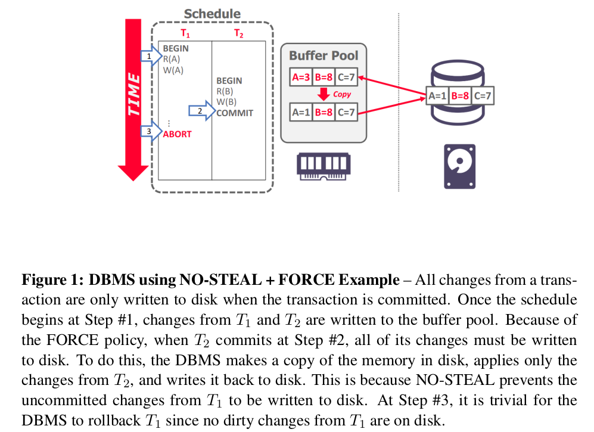
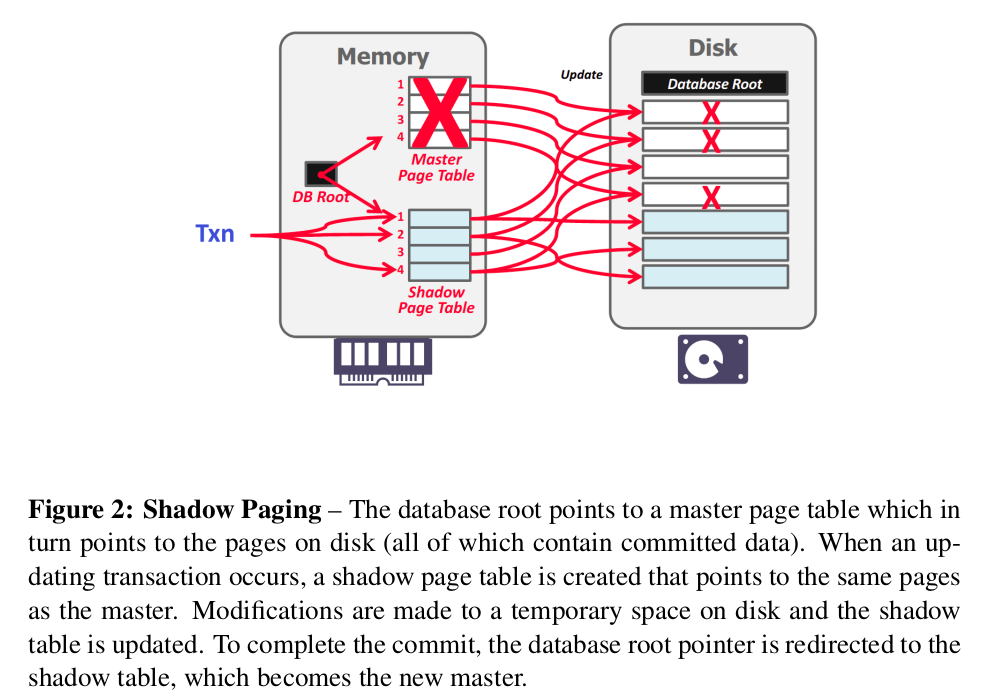
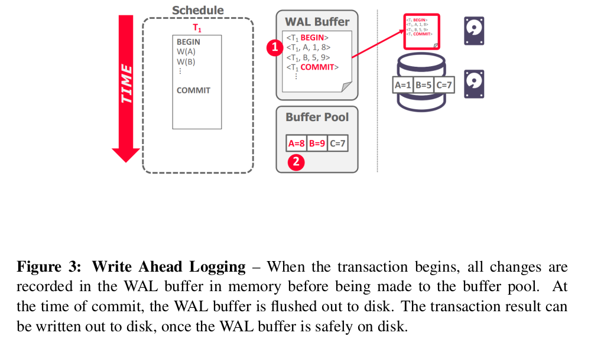

# Recovery System

## Crash Recovery
恢复算法主要包含两部分：
- 在正常事务处理就时采取措施，保证有足够的信息可用于恢复故障
- 故障发生后采取措施，将数据库内容恢复到某个保证数据库一致性、事务原子性以及持久性的状态

## 缓存池管理策略
DBMS需要保证两样东西：
- 任何提交的txn的改动需要持久化
- 不允许持久化中止事务的部分改动

*Steal*策略：允许系统将修改过的块写入磁盘，即便这个块上有未提交事务写入的数据
*No-Force*策略：允许修改了某些还未写回磁盘的块的事务提交

最简单粗暴的策略是*NO-STEAL + FORCE*策略。DBMS不需要回滚那些中断的事务作出的修改，也不需要重做提交的事务作出的修改。

DBMS需要在内存中拷贝一份，只应用T2的修改。

## Shadow Paging

DBMS将以树的结构组织页。有两种拷贝: *master*和*shadow*。`DB Root`总是指向当前的master拷贝。当一个事务执行，它只会改动shadow拷贝。

当一个事务想要commit，DBMS必须安装它的更新。很简单，更新`DB Root`使它指向shadow拷贝就行了。Undo只需要去掉所有shadow pages即可。master和`DB Root`不用改。

复制太多东西，代价太高；数据碎片化，需要垃圾回收；同一时间只能支持单个写事务。

## WAL(Write-Ahead Logging)
在修改写入硬盘之前，DBMS记录所有数据库的修改到一个log文件(stable storage)。Log文件包含足够的信息让DBMS在数据库crash后能undo和redo操作以恢复数据库。log文件要在先于它记录的修改写入磁盘写入。WAL是*STEAL + NO-FORCE*的。

WAL可以将随机写入转换为顺序写入以优化性能。

### WAL实现
DBMS开始会将事务的log记录放在易失性存储上。当一个事务的commit日志记录——这是该事务最后一个日志记录——输出到稳定存储器后，我们就说这个事务提交了。

当事务开始，写一条`<BEGIN>`记录到log，记录事务的起始点。

当事务完成，写一条`<COMMIT>`记录到log，保证在返回ack给应用时，所有记录都刷到了硬盘。

每条日志记录包括以下信息方便回滚：
- txn id
- object id(data item id)
- old value(used for UNDO)
- new value(used for REDO)

DBMS一定要在它告诉外部世界这个事务已经提交前，将事务的log刷到硬盘。系统可以`批提交`log，减少刷盘带来的overhead. log buffer满了或者距离上次刷盘经过一段时间，会触发下一次刷盘。DBMS可以刷入脏页，只要他把对应的log记录也刷到了硬盘之中。

