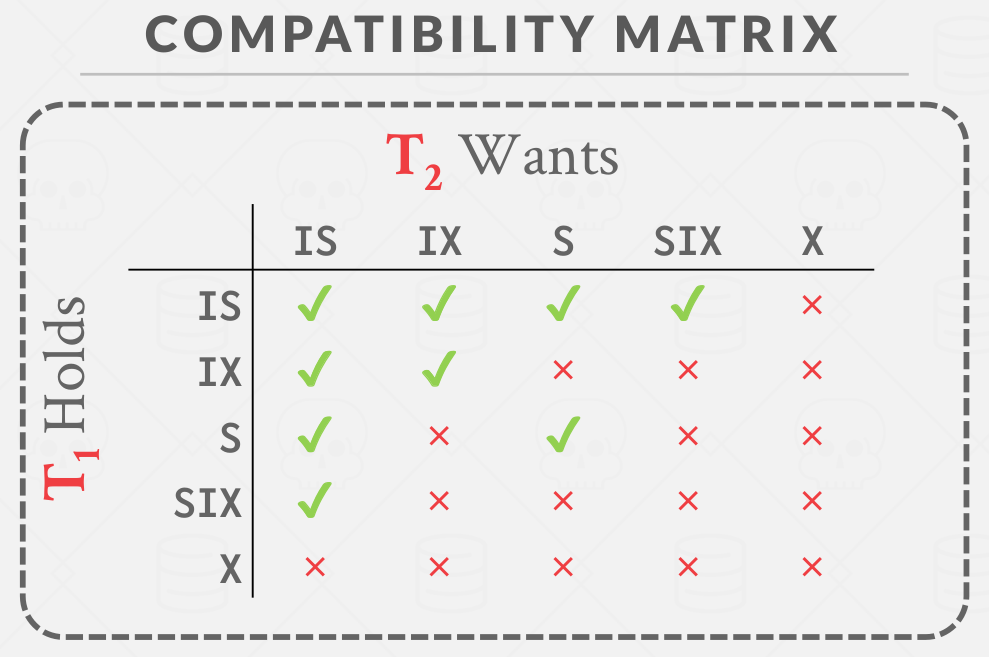
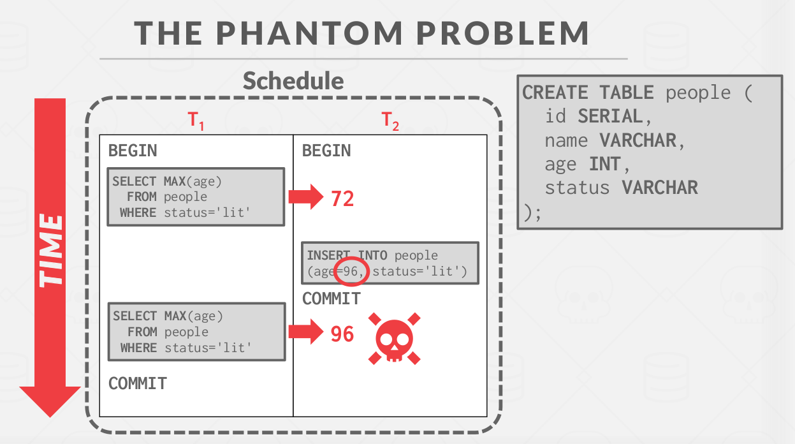
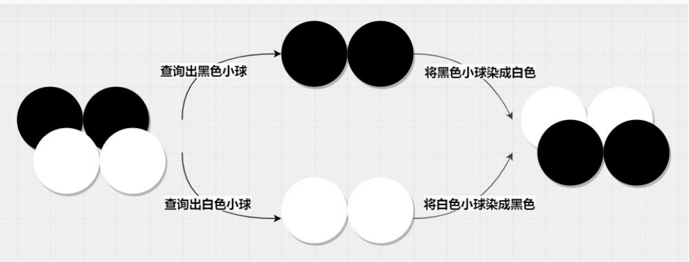
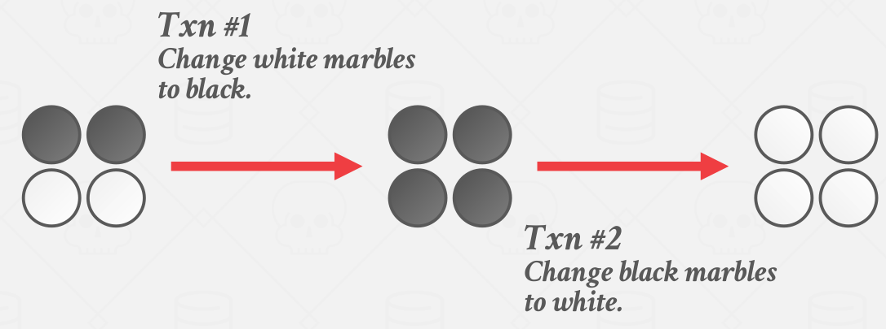
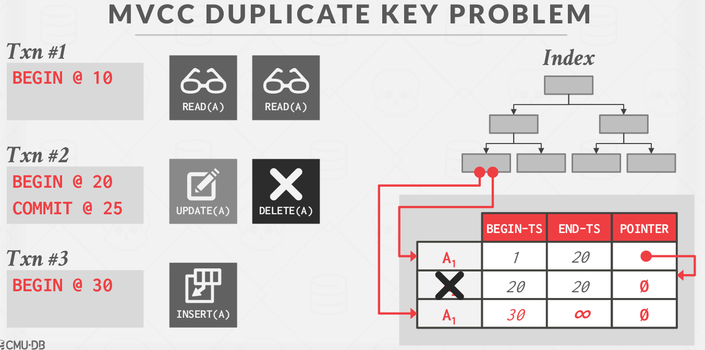

-- Written By **CourierLo**

# Transaction

## 1 ACID
事务其实就是一些操作的集合，也可认为这些操作是一个单一逻辑单元，比如资金转账。这些操作要么全部发生，要么由于出错全部不发生。这个全或无的特性就是**原子性(atomicity)**.

事务是一个单一的单元，它的操作不能看起来被不属于该事务的数据库操作分割开。DBMS必须确保事务正常执行而不被其他事务并发执行的语句所干扰。此为**隔离性(Isolation)**. 每个事务都感觉不到系统有其他事务在执行(与顺序无关).

一个事务要执行转账`A-50 B+50`，那么最后`A+B`的值应该要和事务执行前一样，不能凭空创造不存在的金额，此为**一致性(isolation)**.

一个事务完成，它对数据库的修改必须是永久的，即使系统发生故障，此为**持久性(Durability)**.

### 原子性和隔离性
`aborted`: 事务正常回滚并且DB恢复到事务开始执行前的状态

事务所有语句执行后也不一定会进入`committed`，因为可能写不回硬盘。

### 可串行化(Serializability)
当I和J是不同事务在相同数据项上的操作，并且其中至少有一个是`write`指令时，我们说I和J是冲突的。

两条不同事务且不冲突的连续指令可以交换位置，顺序无关紧要。如果一个调度S可以经过一系列的非冲突指令交换生成另一个S'，则S与S'冲突等价。

**可恢复调度**：T<sub>j</sub>读了T<sub>i</sub>之前写的数据，T<sub>i</sub>必须先于T<sub>j</sub>提交.

### 事务四个隔离级别
- 可串行化(serializable): 保证可串行化调度
- 可重复读(repeatable read)：只允许读取已经提交的数据，并且在一个事务两次读取一个数据项期间，其他事务不可以更新这个数据
- 已提交读(read committed)：不要求重复读，事务两次读取一个数据项期间，另一个事务更新了该数据并且提交
- 未提交读(read uncommitted)：允许读取未提交的数据

### 其他
- 丢失更新：T<sub>j</sub>读了一个数据项，然后T<sub>k</sub>写了该数据项，然后T<sub>j</sub>又写了该数据，T<sub>k</sub>的更新就丢了。可重复读不会发生这个异常。


## 2 **Concurrency control**
为了保证隔离性和一致性。有两大类方法：
1. 悲观：DBMS假设事务总会冲突，所以要阻止问题出现
2. 乐观：DBMS假设事务间冲突很少，所以在事务提交以后再处理这些冲突

并发控制协议就是为了生成一个execution schedule，让事务之间交织运行，最大化并发性能且产生正确的结果，该schedule等价于某个事务间不交织运行的串行schedule。

常见方法有：锁协议(2PL)、基于时间戳协议、多版本并发控制

考虑两个序列t0(S)->t1(SIX)->t2(IS)以及t0(SIX)->t1(SIX)->t2(IS)，假设都是t0获取锁，t1阻塞，此时t3能够获取锁吗？

### 锁协议
饥饿现象：假设T<sub>2</sub>在一个数据项持有共享锁，T<sub>1</sub>要申请排他锁，事务T<sub>1</sub>要等T<sub>2</sub>释放锁，如果还有很多事务申请了共享锁，那么T<sub>1</sub>就要等待这些事务都完成才能持有排他锁了，这就是**饥饿**。

所以，当事务T<sub>i</sub>申请对数据项Q加M锁时，并发控制管理器授权加锁的条件是：
1. 不存在其他事务在数据项Q上持有与M锁冲突的锁
2. 不存在等待对数据项Q加锁且先于T<sub>i</sub>申请加锁的事务(**FIFO**)

当然咯，事务是不会事先知道其他事务的读写集合。使用锁协议，DBMS会维护一个集中式的锁管理器，事务必须向锁管理器申请或者升级锁，由管理器决定是否为该事物赋予锁。

锁管理器不需要持久化，因为DBMS崩溃的时候，进行中的事务会aborted.

### 2PL
该协议要求每个事务分两个阶段提出加锁和解锁请求。

- **P1 #1 -Growing**: 

- **P1 #1 -Shrinking**:

2PL保证冲突串行化。但是2PL可能还会有脏读和死锁出现。**脏读**的定义是：事务T1修改了某个值，事务T2读到了这个值，然而T1中止并且回滚了，T2就读到了脏数据。

### 强2PL
事务只允许在commit再释放锁。


## 3 死锁处理
主要有两种方式处理死锁。应该根据事务间的死锁频率采用不同的方法。

### 死锁检测
DBMS定期建立`waits-for`图，点是事务，T<sub>i</sub>等待T<sub>j</sub>释放锁，则添加对应的边。检测到死锁则选择abort一个`victim`打破死锁。DBMS可以选择回滚点，要么整个事务回滚，要么回滚到死锁刚好解除的地方。

### 死锁预防
死锁预防2PL会在造成死锁的地方中止事务。会杀掉其中一个事务，杀掉哪个呢？事务会根据时间戳被赋予不同的优先级，越老的事务优先级越高。事务重启后也会使用同样的时间戳。
- **Wait-Die**: 请求锁的事务优先级比持有锁的事务更高，等待之，优先级低则它aborts。
- **Wound-Wait**: 和上面不同，优先级高的请求会杀掉持有锁的新事务，aborts并且释放掉锁，否则等待

### 锁粒度
如果事务要更新上亿条tuples，向锁管理器要这么多锁，会炸掉。为了避免这个overhead，DBMS可以使用多级粒度的层级机制，允许不同大小的数据项。就像一棵树。

意向锁允许更高层级的节点以共享或者排他模式加锁，而不用检查它的孩子节点。
- IS: 将在树的底层进行显示封锁，但是只能加共享锁
- IX: ...，能加共享或者排他锁
- SIX: 以该节点为根的子树显式加了共享锁，并且将在树的更低层显式加排他锁

`Intention`: `Intent to get S/X lock(s) at finer granularity.`

### 多粒度封锁协议


1. 必须遵循上图所示的锁类型相容矩阵
2. 每个事务必须获取DB最高级别的锁(锁住根节点)
3. 要想对一个节点上S/IS锁，必须其父节点必须至少持有IS程度的锁(IS/IX)
4. 要想对一个节点上X/IS/SIX锁，必须其父节点必须至少持有IX程度的锁(IX/SIX)
5. 2PL

## 4 基于时间戳的协议

一种比较简单的**乐观**并发控制协议。对于事务T<sub>i</sub>开始执行前，DBMS会赋予一个唯一固定的时间戳TS(T<sub>i</sub>)。简单的时间戳排序协议如下：
1. 假设事务T<sub>i</sub>发出**read(Q)**
a. 若TS(T<sub>i</sub>) < W-TS(Q)，T<sub>i</sub>要读的Q值已经被覆盖，read操作会被拒绝，T<sub>i</sub>回滚

b. 若TS(T<sub>i</sub>) >= W-TS(Q)，则执行read，R-TS(Q) = Max(R-TS(Q), TS(T<sub>i</sub>))

2. 假设事务T<sub>i</sub>发出**write(Q)**
a. 若TS(T<sub>i</sub>) < R-TS(Q)，则T<sub>i</sub>产生的Q值是时先所需要的值，write会被拒绝，回滚

b. 若TS(T<sub>i</sub>) < W-TS(Q)，则T<sub>i</sub>尝试写入的Q值已经过时，write会被拒绝，回滚

c. W-TS(Q) = TS(T<sub>i</sub>)

时间戳排序协议保证冲突可串行化，因为冲突按照时间戳顺序进行处理。保证无死锁。但是短事务可能会引起长事务反复重启。

### Thomas写规则

针对write的第二点(唯一区别)：
b. 若TS(T<sub>i</sub>) < W-TS(Q)，则T<sub>i</sub>尝试写入的Q值已经过时，**这个write会被忽略**

允许了非冲突可串行化但是正确的调度。Thomas实际上通过删除事务发出的过时的write操作来使用视图可串行性。

## 5 乐观并发控制OCC

DBMS为每个事务创建一个私有工作空间。
- 任何读都复制到这个空间
- 任何改动都applied到这个空间

当一个事务要提交的时候，DBMS会对比工作空间的写集，看看它有无和其他事务发生冲突。如果没有冲突的话，就把写集安装到'全局'的database之中。

### OCC三个阶段

1. 读阶段：跟踪事务的读/写集合，并将集合写入到私有工作空间。具体是复制txn访问到的所有tuple到工作空间，以保证repeatable read.
2. 验证阶段：当事务提交时，检查是否与其他事务发生冲突
3. 写阶段：当验证完成后，应用私有工作空间的修改到database之中。否则abort并且重启事务 

当事务进入验证阶段，DBMS赋予他们时间戳。为了保证可串行调度，DBMS检查T<sub>i</sub>和其他事务有无RW或者WW冲突(old->new).

潜在的问题：复制数据很花时间，验证很花时间，ABORT被延后了代价很高，timestamp分配很花时间

## 6 幻读

<u>Insertion or deletions result in different results for the same range scan queries.</u>



造成的原因是T<sub>i</sub>只锁住了存在的记录而没有锁住即将到来的记录。

解决办法：
1. 提交的时候重新scan，检查是否产生了不同的记录。`Run the scan for an UPDATE query but do not
modify matching tuples.`
2. 锁谓词
3. 索引封锁


## 7 多版本并发控制MVCC

MVCC中，每个`write(Q)`会创建一个Q的新物理版本。当事务发出一个`read(Q)`操作的时候，并发控制器选择Q的一个版本进行读取。并发控制机制必须保证用于读取的版本的选择能保持可串行性。MVCC是一个比并发控制协议更大的概念，它包含了DBMS实现的方方面面，MVCC单独使用无法做到SERIALIZABLE隔离级别，除非和别的并发控制手段结合。

MVCC的核心概念：
- Writers do not block readers
- Readers do not block writers

使用MVCC的其中一个好处是，只读事务可以不用上锁去读一个一致的数据库快照，另外MVCC支持time-travel的查询，比如说查询三小时前的结果。

MVCC包含四个重要的部分：
1. 并发控制协议
2. 版本存储
3. 垃圾回收
4. 索引管理

### 快照隔离
快照隔离旨在为事务提高提供一个数据库一致性快照，快照的数据仅仅包含已经提交的事务，事务与其他事务完全隔离运作直到结束。写操作发生在事务的私有工作空间，只有事务提交以后他们才能在数据库中可见。如果两个事务同时对一个Object进行更新，最开始那个写事务赢。

### 快照隔离问题1: 写偏序异常
两个并行事务都基于自己读到的数据集去覆盖另一部分数据集，在串行化的情况下两个事务无论那种顺序执行，最终都会达到一致状态，但在快照(Snap)事务隔离级别下无法实现，即黑白球问题：

False:



True:



一对事务中的每一个都读取对方要写的数据，但是不存在两者同时写的数据。

### 版本存储 Version Storage
多个物理版本，一般来说DBMS会使用tuple的指针域创造出根据时间戳排序的版本链表。索引会永远指向这个链表的头部，要么是最新的，要么是最旧的。

- Append-Only Storage

一个逻辑tuple的所有物理版本都存在同一张表上。每次更新新的版本就直接加入并且更新链表就可以。

- Time-Travel Storage

DBMS维护一张单独的表(time-travel table)，它保存了旧版本的tuples。每次更新，DBMS复制旧版本的tuple进去，并在主表中使用新数据覆盖。主表tuple的指针指向time-travel table上个版本。

- Delta Storage

就像Time-Travel Storage，但是DBMS只存更改部分的数据(changes between tuples). 事务通过遍历deltas可以重建旧的版本。写很快，读会慢一点。

### 垃圾回收
DBMS需要删掉可以回收的旧版本。可回收的意思是没有活动的事务会"看到"这个版本，又或者这个版本是被aborted的事务创建的。

1. Tuple-level GC
DBMS通过直接检查tuple找到旧版本
- 后台清理: 单独的线程定期扫描表，查找可回收的版本。可以维护dirty page bitmap进行优化，用于追踪哪些page自从上次扫描被修改过。
- 协同清理：worker线程通过遍历版本链表检查可回收的版本。只好用在O2N链。
2. Transaction-level GC

每个事务需要跟踪它们的旧版本，这样DBMS就不用扫描tuple了。每个事务需要维护他们自己的读写集合。当一个事务完成，垃圾收集器届可以根据读写集判断哪些tuple是可回收的。DBMS将判定所有由一个完成的txn创建的版本不可见。(DBMS determines when all versions created by a finished transaction are no longer visible.)

### 索引管理
所有主键索引总是指向版本链的头部。更新的频率和创造新版本的频率相关。如果事务更新了逐渐的attr,它需要删掉再插入。维护二级索引会更复杂，有两种方法：
1. 逻辑指针：增加中间层，tuple更新的时候更新中间层映射就可以拉
2. 物理指针：全部指向版本链又不，需要更新所有二级索引指针

### MVCC Duplicate Key Problem


Txn3在插入A的时候，发现A不存在(Txn2之前删掉了)，然后插入了A1(第一个版本)，这就造成了真正的A1丢失了。所以版本号还不能这样简单地设置。

所以mvcc的删除还没这么简单。

总之，**DBMS必须在提交时而非在快照上检查完整性约束**。DBMS会在快照之外检查主键冲突，并且回滚事务中的一方。

SQL查询语句可以添加`for update`子句，防止快照异常：
```sql
select *
from instructor
where ID = 22222
for update;
```
添加`for update`之后系统会将读取的数据作为**刚更新**的数据对待。

## Project 4 锁管理器实现不同的隔离级别

### LOCK NOTE
GENERAL BEHAVIOUR:
> 锁表和锁行都是阻塞的方法，他们应该等待，直到锁被赋予，然后返回。如果事务中途abort，不要赋予锁，返回false。

MULTIPLE TRANSACTIONS:
> 锁管理器要为每个资源维护一个队列，多个事务的情况下锁的赋予要遵循FIFO的原则。如果有多个兼容的锁请求，所有事务需要同时被赋予锁，当然也不能破坏FIFO的原则。

ISOLATION LEVEL:
- `SERIALIZABLE`: 事务串行执行
- `REPEATABLE READS`: `GROWING`阶段允许任何类型的锁，`SHRINKING`阶段不允许任何锁
- `READ-COMMITTED`: `GROWING`阶段允许任何锁，`SHRINKING`阶段只允许上IS/S锁(不满足2PL)
- `READ-UNCOMMITTED`: `GROWING`阶段只允许持有X/IX锁，永远不能持有S/IS/SIX锁

MULTILEVEL LOCKING:
> 在锁行的时候必须检查事务又没有在对应的表上有合适的锁。如果要加行X锁，表上必须要有X/IX/SIX这三把锁的其中一把。如果不存在，事务abort并且抛出异常。

LOCK UPGRADE:
- 同一资源如果事务要求的锁和它之前要求的锁一样，直接返回true.
- 如果不同，则要锁升级。锁升级的请求相较于其他等待锁的事务，优先级是最高的。

升级规则如下：

IS -> [S, X, IX, SIX]

S -> [X, SIX]

IX -> [X, SIX]

SIX -> [X]

不符合条锁升级的条件要中断事务。而且，只允许一个事务对一个资源进行锁升级。多个锁升级要中断事务，抛出UPGRADE_CONFLICT异常。(这是为了简化代码实现。其实可以做到多个同时锁升级的，但是要多维护一个升级队列)

BOOK KEEPING: 事务本身也要维护他自己持有的锁的集合

### UNLOCK NOTE

GENERAL BEHAVIOUR: 
必须要持有锁才能UNLOCK，否则中断并且抛异常；释放表锁时不能再持有任何行锁，否则中断；解锁之后，应该允许其他等待的锁请求获取锁(Wakeup)。

TRANSACTION STATE UPDATE:
只有Unlock S/X锁才会影响事务的状态(根据隔离级别)。
- REPEATABLE_READ：
解S/X锁要置事务状态为SHRINKING
- READ_COMMITTED：
解X锁要变SHRINKING；解S锁不影响。
- READ_UNCOMMITTED: 
解X锁要变SHRINKING；READ_UNCOMMITTED不允许S锁，解S锁时未定义的行为。

BOOK KEEPING:
同样地要维护txn自身的持锁集合。

### 代码注释：上锁/解锁流程
```C++
auto LockManager::LockTable(Transaction *txn, LockMode lock_mode, const table_oid_t &oid) -> bool {
  /* Step 1: 检查事务状态，另外检查隔离级别查看上的锁是否合法 */
  if (!CheckTxnStatus(txn, lock_mode)) {
    return false;
  }

  /* Step 2: 获取对应资源的请求队列，注意加锁 */

  /* Step 3: 检查队列是否存在相同事务的旧请求 */

  /* Step 4：有相同事务的旧请求 */

  /* Step 4.1.1: 判断是否需要锁升级，只允许一个锁升级 */
  /* Step 4.1.2: 判断是否符合锁升级的条件 */
  /* Step 4.1.3: txn删掉之前的锁，同时删掉队列中的旧请求，标记升级txn id, 在第一个未赋锁的记录之前插入新记录 */

  /* Step 4.2: 不是锁升级，把新纪录放在队列末尾 */

  /* Step 4.3: 检查兼容性, 如不符合则在条件变量上等待，唤醒时继续判断是否该赋予锁 */
  while (!GrantLock(table_queue, cur_req_ptr)) {
    // cur_req_ptr MUST STILL IN table_queue
    table_queue->cv_.wait(lock);

    if (txn->GetState() == TransactionState::ABORTED) {
      // ... 如果是锁升级，重设；删掉队列里的记录并且**进行一次唤醒**
      return false;
    }
  }

  /* Step 5: BOOK KEEPING，更新txn的锁集 */

  /* Step 6: 如果是锁升级，重设 */

  return txn->GetState() != TransactionState::ABORTED;
}
```
通过`GrantLock()`判断是否可以赋予锁：
```C++
auto LockManager::GrantLock(const std::shared_ptr<LockRequestQueue> &queue, LockRequest *cur_req_ptr) -> bool {
  /* Step 1: 和队列之前的请求比较，利用兼容性矩阵检查兼容性 */

  /* Step 2: 检查优先级 */
  // 这个txn是不是锁升级？
  // 检查当前txn是不是和之前所有txn兼容(兼容性前缀和，状态压缩暴力打表), 不一定符合FIFO ?
  // 考虑两个序列t0(S)->t1(SIX)->t2(IS)以及t0(SIX)->t1(SIX)->t2(IS)，假设都是t0获取锁，t1阻塞，此时t3能够获取锁吗？如果单纯使用前缀和，后一种情况t2可以获得锁，而前者不可以。如果是严格的FIFO，应该需要检查前面的每个txn和他之前的所有txn是否兼容才行
}
```
上表锁和上行锁类似，但是得先判断是否拥有对应的表锁。
```C++
/* Step 1.2: Check whether txn is holding corresponding table lock */
// if an exclusive lock is attempted on a row, the transaction must hold either X, IX, or SIX on the table
if (lock_mode == LockMode::EXCLUSIVE) {
  if (!txn->IsTableExclusiveLocked(oid) && !txn->IsTableIntentionExclusiveLocked(oid) &&
      !txn->IsTableSharedIntentionExclusiveLocked(oid)) {
    AbortTxnAndThrow(txn, AbortReason::TABLE_LOCK_NOT_PRESENT);
    return false;
  }
}
// 行S锁则不论表有什么锁
```

解除表锁：
```C++
auto LockManager::UnlockTable(Transaction *txn, const table_oid_t &oid) -> bool {
  /* Step 1: 检查txn是否持有该锁 */
  /* Step 2: 检查txn是否还持有该表的行锁，有则异常 */
  /* Step 3: 找到对应的请求队列并锁住queue_latch，删掉队列对应的请求 */
  /* Step 4: 如果事务处于GROWING态，判断是否要进入SHRINKING */
  /* Step 5: 修改txn锁集合 */
  /* Step 6: 解锁，唤醒队列中其他请求 */
}
```
解除行锁大差不差，不用检查表锁状态。

### 代码注释：死锁检测
```C++
void LockManager::RunCycleDetection() {
  /* Step 1: 建立waits_for有向图，t1->t2 即代表t1事务正在等待t2事务释放资源 */
  /* Step 2: DFS搜索环，DFS途中用个栈记录一下环的起始点 */
  /* Step 3: Abort掉txn，唤醒所有队列 */
  /* Step 4: 清理waits_for图，重复Step 2直到没有死锁完成一轮检测 */
}
```

### 代码注释：并发查询
我们仅需修改`SeqScan`、`Insert`和`Delete`三个算子。其他算子获取的`tuple`数据均为中间结果，并不是表中实际的数据。而这三个算子是需要与表中实际数据打交道的。其中`Insert`和`Delete`几乎完全一样，与`SeqScan`分别代表着写和读。

- SeqScan

如果隔离级别是`READ_UNCOMMITTED`则无需加锁; 在`READ_COMMITTED`下，在`Next()`函数中，若表中已经没有数据，则提前释放之前持有的锁。在`REPEATABLE_READ`下，在`Commit/Abort`时统一释放，无需手动释放。

为什么`SeqScan`不直接对表上S锁呢？主要是后续可以进行一个merge filter scan的优化，把filter放进`SeqScan`里，这种情况下就是表IS + 符合条件的行S。

如果直接表S的话，执行一个`DELETE ... WHERE ...`，同一个query里先在下层`SeqScan`加了S锁，又尝试在Delete里加IX锁，但是S不能升级为IX，会导致这条query执行不了，升级不兼容。所以还是`SeqScan`也用表IS+行S比较容易实现。

- Insert / Delete

在`Init()`函数中，为表加上IX锁，再为行加X锁。同样，若获取失败则抛`ExecutionException`异常。另外，这里的获取失败不仅是结果返回false，还有可能是抛出了`TransactionAbort`异常，例如`UPGRADE_CONFLICT`，需要用`try catch`捕获。

锁在`Commit/Abort`时统一释放，无需手动释放。

### Why intention locks on table ?
1. 测试中会出现先delete再seqscan的情况，当delete一个tuple时会被标记deleted，当seqscan扫描时会调用`GetNextTupleRid`函数，如果一个tuple被标记了那么会跳过这个，也就是说返回的rid不会有已经被删除并且被上X锁的tuple rid了. 如果不上意象锁的话过不了测试的。

但是不存在predicate可以filter的时候，也就是全表扫描，能直接加S锁吗？过不了测试，very strange.

2. p3.16: `INSET ******FROM result`
在事务里对一张表先insert再select确实会锁升级异常，或许可以改一下RR级别下遇到锁升级异常的处理逻辑？已经持有X锁就不需要再去获取S锁了。这个地方我也一直不太清楚

### Leaderboard Task
1. Predicate Pushdown to SeqScan
2. Implement UpdateExecutor 就地修改，不必delete再insert. 表IX，行X.
3. Use Index 使用索引, 单点查询时 IndexScan 算子中要注意加锁，表IS,行S。
```C++
// optimizer_custom_rules.cpp
auto Optimizer::OptimizeMergeFilterScan(const AbstractPlanNodeRef &plan) -> AbstractPlanNodeRef {
  std::vector<AbstractPlanNodeRef> children;
  for (const auto &child : plan->GetChildren()) {
    children.emplace_back(OptimizeMergeFilterScan(child));
  }

  auto optimized_plan = plan->CloneWithChildren(std::move(children));
  if (optimized_plan->GetType() == PlanType::Filter) {
    const auto &filter_plan = dynamic_cast<const FilterPlanNode &>(*optimized_plan);
    BUSTUB_ASSERT(optimized_plan->children_.size() == 1, "must have exactly one children");
    const auto &child_plan = *optimized_plan->children_[0];
    if (child_plan.GetType() == PlanType::SeqScan) {
      const auto &seq_scan_plan = dynamic_cast<const SeqScanPlanNode &>(child_plan);

      // Project 4 optimization: if filter's predicate like "x = a" and table has an index on x,
      // we can make filter-seq_scan => index_scan. This step must proceed before filter into seq_scan
      // x: ColumnValueExp | a: ConstValueExp
      if (seq_scan_plan.filter_predicate_ == nullptr) {
        if (auto *expr = &filter_plan.GetPredicate(); expr != nullptr) {
          if ((*expr)->GetChildren().size() == 2) {
            if (auto *left_expr = dynamic_cast<ColumnValueExpression *>((*expr)->GetChildAt(0).get());
                left_expr != nullptr) {
              if (auto *right_expr = dynamic_cast<ConstantValueExpression *>((*expr)->GetChildAt(1).get());
                  right_expr != nullptr) {
                // is left_expr an index of table?
                const auto *table_info = catalog_.GetTable(seq_scan_plan.GetTableOid());
                auto indices = this->catalog_.GetTableIndexes(seq_scan_plan.table_name_);
                for (auto &index : indices) {
                  const auto &columns = index->key_schema_.GetColumns();
                  if (columns.size() == 1 &&
                      columns[0].GetName() == table_info->schema_.GetColumn(left_expr->GetColIdx()).GetName()) {
                    // found match index, create IndexScanPlanNode and return
                    return std::make_shared<IndexScanPlanNode>(filter_plan.output_schema_, index->index_oid_,
                                                               right_expr);
                  }
                }
              }
            }
          }
        }

        return std::make_shared<SeqScanPlanNode>(filter_plan.output_schema_, seq_scan_plan.table_oid_,
                                                 seq_scan_plan.table_name_, filter_plan.GetPredicate());
      }
    }
  }

  return optimized_plan;
}
```
