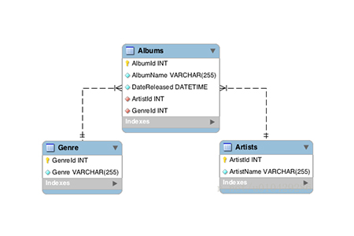
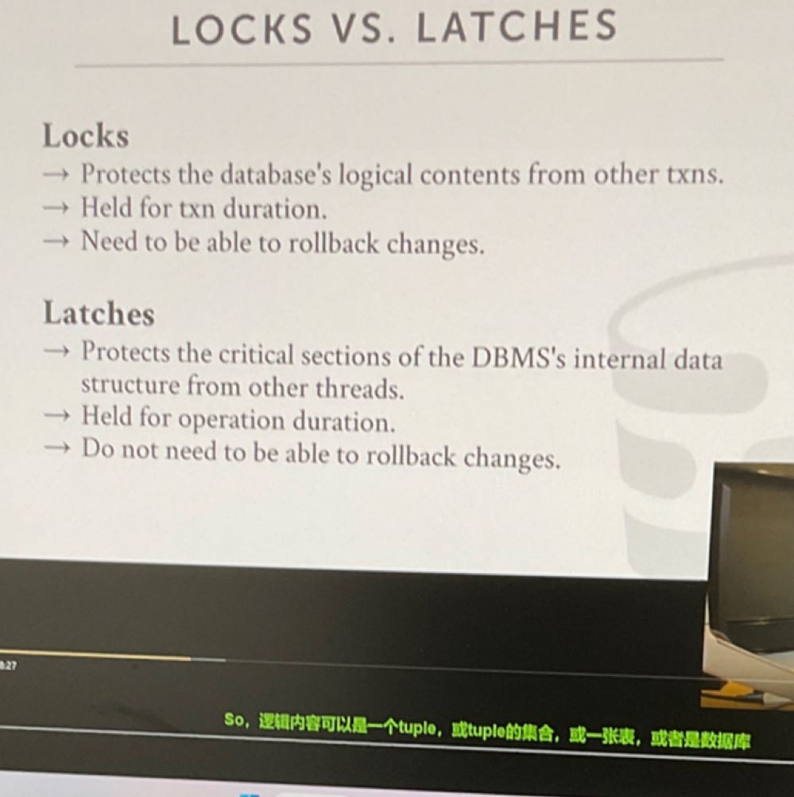

Written By **Benny Chen**

*I don't think it's good enough. I will rewrite it when I have time.* —— CourierLo

比较重要的东西：
- schema(模式)表示的是数据库对象的集合，它包含了各种对象：如表、表的属性、索引、视图以及表之间的关系。也就是说，Schema对数据库的结构和组织进行描述，如下图所示。但要注意的是，shcema通常代表的是数据库的逻辑组织，而不是实际的物理组织。不同的 DBMS 具有不同的schema术语和实现细节。 有些人使用术语“schema”来指代特定的命名空间(比如每个用户一个schema)或数据库对象的集合，而另一些人则使用它来描述数据库的整个逻辑结构。 然而，schema的核心概念（作为表、属性和关联的描述）在各个DBMS中保持一致。

- 数据完整性约束：防止不符合规范的数据进入数据库
- 单个表实际上是定义了一种关系(离散)，然后每个tuple是一个关系所涉及的属性的笛卡尔积的一个实例，或者说是一个具体的元素，也就是说表中数据就是这个关系的实例集合。
- 关系代数和SQL就看我的笔记就行了，做了lab基本都懂了，不过要注意一下select表达式的情况
- Page的描述和页间组织方式：
>     存储管理器将数据库文件组织为一个个page，使得DBMS可以追踪page的读写，以及page中有多少可用的空间，此外每个page的大小是固定的，这样可以方便page的读入和写出，以及进行处理。通常每个关系(表)使用一个单独的文件。对于每个page，它一般只保存一种类型的数据，比如tuple、元数据、日志等，不会混合存放。此外，tuple可以放到文件的任何一个page中，不需要有顺序(除非你是聚簇索引，page中tuple的物理位置和我们在索引中定义的顺序相匹配)。每个page都会分配一个唯一的page id，用于标识每一个page，因此DBMS可以通过将page id和物理地址关联，从而找到对应的page。page在文件中组织方式一般采用堆文件组织，采用一个双向链表来连接文件中的所有page(lab3)。
- 页内组织方式
>     一般采用slotted page，如下图所示，但具体还是看lab3。这种page组织方式包含了一个文件头，一个slot数组以及一个空闲空间。文件头用于记录前后page的位置、page id、校验和、DBMS版本、事务可见性、slot数组使用情况等。slot数组记录每一个存储在空闲空间中的tuple的偏移，以此找到每个tuple在空闲空间中的存放位置，slot数组是从低址往高址写。空闲空间则是用来存放tuple，它从高址往低址写入tuple。且从这里可以得到，每一个tuple可以通过page id + slot id进行标识，从而得到record id。
- tuple的组织方式
>     同样是文件头+数据，分为定长和变长记录，定长记录应用于在一个文件中只有一种类型的记录，且所有字段都是定长的(lab3)。变长记录应用于在一个文件中存放着多种类型的记录，即不同关系的记录分散到了不同文件中，而不是放在同一个文件里面（还有两种情况也可以用变长：允许一个或多个字段是变长的记录类型，允许可重复字段的记录类型，如数组或多重集合）。具体tuple怎么实现就看自己了。一般而言，不会将不同表的数据放到同一个page中。此外，对于工程实现，属性在tuple中存储的顺序是按照create table时指定的先后顺序存储的。

- 一般而言，DBMS不允许tuple的大小超过一个page的空闲空间大小，但如果超过了，那么可以使用overflow page，但尽量避免。但也可以使用外部存储，overflow page是存在于内存中的，但有时这部分超出page大小的数据可以放到磁盘中，等到要用时才读进来。
- OLAP和OLTP的概念和异同
>     OLTP(联机事务处理)：OLTP专门为事务处理进行设计，支持日常操作任务。其特点是会有大量高并发且涉及的数据量级不大的简单查询(经典增删改)，并且这些查询涉及的数据一般是数据库中的单个或若干个数据实体(比如一条tuple或多条tuple)。该系统支持大量人员实时执行大量数据库事务，并且对写密集型操作进行了优化。为了可以更快速地进行增删改，提高对完整数据实体的查询效率，减少磁盘I/O，一般采用行式存储(NSM模型)。
>     OLAP(联机分析处理)：OLAP专门为复杂的分析任务而设计，它提供了从多个维度和角度查询和分析大量数据的方法。其特点是查询频率较OLTP系统更低，但通常会涉及到非常复杂的查询，因此需要读取大量的数据，而这些数据横跨多个数据实体。为此，OLAP数据库针对读密集型操作进行了优化，该系统支持对大量数据的聚合以及对大量数据进行快速访问。由于分析内容通常是针对多个数据实体的同一个属性，因此一般采用列式存储(DSM模型)。
>     主要区别：
>             1. 侧重点：OLAP 系统允许您提取数据以进行复杂分析。为了推动业务决策，查询通常涉及大量记录。相比之下，OLTP 系统非常适合在数据库中进行简单的更新、插入和删除。查询通常只涉及一条或几条记录。
>             2. 数据源：OLAP 数据库具有多维模式，因此它可以支持从当前和历史数据中对多个数据事实进行复杂查询。不同的 OLTP 数据库可以作为 OLAP 聚合数据的来源，它们可以组织为一个数据仓库。另一方面，OLTP 使用传统的 DBMS 来容纳大量实时事务。
>             3. 处理时间：在 OLAP 中，响应时间比 OLTP 慢几个数量级。工作负载是读取密集型的，涉及大量数据集。对于 OLTP 事务和响应，每毫秒都很重要。工作负载涉及通过 SQL（结构化查询语言）进行的简单读写操作，需要更少的时间和更少的存储空间。
>             4. 可用性：由于它们不修改当前数据，因此 OLAP 系统的备份频率可以降低。然而，OLTP 系统经常修改数据，因为这是事务处理的本质。它们需要频繁或并发备份以帮助维护数据完整性。
- Buffer Pool的作用：见lab1
- Buffer Pool和虚拟内存的异同，以及为什么要用Buffer Pool
>     Buffer Pool和虚拟内存是相似的，都是为了支持超过可用内存量的数据。当用户进程需要用到某个数据页，那么需要先检查这个页是否存在内存中，如果不在，那么就需要将这个数据页从磁盘中读到内存里面缓存。当内存紧张时，就需要用置换算法从内存中淘汰一些页，以腾出部分内存空间来读取新的数据页。而最大的区别是OS只能看到读写调用，而不知道这些数据页是否有线程正在使用，以及应该将哪些数据页提前读进来，还有何时将脏页写出。而DBMS则能够监测到哪些线程正在使用这些数据页，事务的完成情况，因此能够更好地决定数据移动的时机和数量，具体包括(这也是为什么要使用Buffer Pool的原因)：
>             1. 根据具体情况预取数据页，由于DBMS知道输入的SQL语句，因此可以知道要读取哪些数据页(比如用索引查询的优化，在找到所有读取的tuple所对应的page后，可以先对要读取的page进行整理，对于处于同一个page的tuple则可以一起读取，并且这些page可以一起预读到Buffer Pool中)，而这些页可能不是相邻的。但虚拟内存的预读是根据空间局部性，但读进来的东西不一定又用。
>             2. 可以将脏页和日志按正确的顺序写回磁盘，并且可以控制其写回的时间，从而确保对数据页或日志的修改可以及时可靠地保存到磁盘。虚拟内存对于脏页并不会立即刷新到磁盘，并在稍后或者满足某些条件时才会写回到磁盘文件中。此外，我们如果使用虚拟内存，我们无法控制何时写出，OS可以随时将脏页重写回磁盘，而不管事务是否已经提交，DBMS无法阻止其刷新，且不会在刷新时收到任何警告，这就导致了事务安全性问题。
>             3. 可以修改并定制页面置换策略。(用lab的LRU-K举例)假设都使用LRU-K，虚拟内存只能够根据读写调用置换页面，然而不知道置换出去的页面是否还有线程使用。而Buffer Pool可以检测到是否线程使用页面，从而在LRU-K的基础上淘汰那些没有线程使用的页面，从而减少磁盘的I/O。
  
- Buffer Pool的优化:
>     1.开辟多个Buffer Pool：一个表使用一个Buffer Pool，从而减少锁争用，并提高并发性。
>     2.预取：由于DBMS知道当前的查询语句正在查询什么，因此可以将后面可能要用到的page预读到Buffer Pool中。但并非根据空间局部性，比如对索引查询的预取。
>     3.查询共享：复用某个查询从磁盘中读取到的数据，将该数据用于其他查询。通过游标的方式，将一个查询的游标附着到另一个查询的游标上，跟着被附着的查询读取相同的内容，最后再读取自己没有读取的数据。
>     4.buffer pool旁路：在某些情况下，为了避免污染buffer pool，执行查询的线程可能额外开辟一个内存空间，然后在这个空间上存放要读取的page，而不是将这些page放到buffer pool中。(仅适用于需要读取的数据量不大的情况)

- direct I/O在445里面没做过，我也不敢乱吹，看看笔记pdf的114页，里面有解释。具体原因是为了防止OS提供的文件读取api会将文件缓存(实际上是文件系统的锅)，然后buffer pool里面又有一份缓存，这就出现两份缓存数据。
- 索引失效：
>       当我们使用左或者右模糊匹配的时候，也就是like %xx，会造成索引失效，具体的原因在于模糊匹配无法提供一个完整的key给hash表或者是B+树，这就导致无法使用这两种索引方式进行查询。
- 复合键索引：
>       当使用多个属性构建的B+树索引(这也是B+树的一个优势)，其key称为复合键。查询时将根据组成复合键的属性值进行查询。比如由3个属性构成的复合键<a, b, c>，假设a为前缀，b为中缀，c为后缀。当要查询时要决定往哪个孩子节点进行查找时，先比较前缀，相同再比较中缀，以此类推。此外，即使不提供完整的复合键，也能够完成查询。即我们只提供前缀、中缀、后缀的一个或任意几个都可以进行查询，但不同的查询性能不同。最简单的是提供前缀，因为第一个匹配的键是前缀，并且只要满足前缀的value都是我们要找的内容，同时满足前缀的value基本都是相邻接的。最麻烦是只提供后缀，因为还需要对前缀的值进行猜测，而且对应后缀的值并不是邻接的。
- B+树索引的非唯一键处理：
>       由于属性值可以重复，但构建B+树索引时必须是唯一键(445是对重复Key不进行处理)。因此有两种方法:
>              1.允许重复key出现，但仍然需要保证其唯一性。具体做法有两个：1、由于record Id是唯一的，因此可以将key和record Id组合成一个复合键，然后放到B+树中。此时对某个属性值的查询就变成了复合键的前缀查询。  2、叶子节点向下扩展，即假设一个key找到了它要插入的叶子节点，而该叶子节点已经存在该key，此时可以让这个叶子节点连接一个overflow page，然后将要插入的key放到这个page中(复杂，不考虑)。
>              2.使用value list：B+树中的key是唯一的，但相同key的tuple可以用一个链表组织，即用一个链表将这些重复key的value放到同一个链表中。

- 并发控制的目的是让DBMS根据某种并发控制协议，以保证多个并发操作对某个共享数据进行处理时，也能够得到正确的结果，此外还具有高并发性。并发控制分为两个层面：逻辑正确性和物理正确性。其中逻辑正确性是对数据库的逻辑内容而言，即在事务的层面，要求多个事务可以以正确的方式并发地对数据库对象(如表、行)进行访问(看杰哥的transaction)。而物理正确性则是对数据库内部的数据结构而言，即在线程层面，要求多个线程可以以正确的方式对内存中的数据结构并发地访问和更新，保证内部数据结构正确性(下面)。对于两个层面的并发控制，所用的锁的名称以及对比如下图：

- B+树的并发控制协议
>               Latch Crabbing(悲观锁)：该协议的加锁方向是从根节点到叶子节点(从上往下)，并不包括叶子节点的迭代器(从左往右)。具体的加锁方式是：当我们要进入一个节点时，必须要获得该节点的锁(读或写)。接着，我们想要前往孩子节点时，必须要获得孩子节点的锁。然后，当我们落到孩子节点上时，我们需要对孩子节点的内容进行测试，如果我们判断出来我们移动到的孩子节点是安全的，那么就可以释放父节点及其以上的锁。如此循环直到叶子节点，然后就可以进行我们的操作。
>               安全性判断：对于查询而言，由于不会对B+树的任何节点进行修改，因此每落到一个孩子节点，它都是安全的，因此可以释放父节点的锁。而对于insert操作，孩子节点是否安全的判断标准是孩子节点保存的key的数量是否到达孩子节点key的最大容量，如果没有，那么就是安全的，否则就是不安全的，因为孩子节点满了就需要分裂，分裂需要用到父节点。对于Delete，安全的标准是孩子节点当前保存的key数量超过最大容量的一半。
>               注意：在拿根节点的锁之前，还需要拿一把全局锁，这是为了防止B+树的升高和下降引起根节点发生变化。只有在访问过程中发现安全节点，才会释放这把全局锁。
- B+树的乐观锁
>               假设大部分的线程不需要对叶子节点进行拆分或者合并操作，为此向下访问节点的过程中，按照查询操作的加锁方式进行加锁，只有到了叶子节点才加写锁(对于insert和delete而言)。当在叶子节点中判断不需要拆分或者合并时，那么就直接修改叶子节点即可。否则立刻中止操作，并释放所有锁，然后从根节点开始重新执行latch crabbing操作。这种方法在争用率很高的情况下，乐观假设是错误的，还是得用latch crabbing来做。
- B+树水平遍历(叶子节点迭代器)加锁
>               在进行水平遍历的时候，也要像latch crabbing一样加锁，但仍然可能会发生死锁。比如一个delete操作和一个叶子节点的遍历。如果delete要与左兄弟进行合并，然而此时左兄弟的锁已经被水平遍历拿到，则会发生死锁。最easy的方法是设定一个计时器，如果拿锁超时，就让迭代器线程自杀，然后重启该操作。
- 算子的实现方式(循序扫描永远是保底)，具体内容看lab3
>               Group By和Distinct(去重)：可以用sort的方法，也可以用hash的方法。但hash需要注意，尽量使生成的hash表放进内存里面，如果超出内存导致要落盘的话则会增加额外的I/O。但假如遇到了超过可用内存的情况，那么思路就像可扩展hash一样，先对数据进行分桶，然后对桶内的数据进行hash，加入桶内数据还是太多，那么可以继续进行分桶，直到可以将hash表放进内存中。如下图(External hashing aggregate)。
>               Join(这里针对的是等值连接和外连接，且是一次返回一条join结果)：join的作用是为了将两个或多个表按一定规则进行连接，并且为了提升性能，始终以更小的表作为join操作的左表。可以使用Nested Loop Join、sort-Merge Join、Hash Join。

- Join操作的输出(是否丢弃部分属性值)，具体还是看lab3
  1. 将两个表中所有的属性值都保留下来，然后交付到上层查询算子。好处就是不需要再从基础表中获取数据，坏处是需要占用太多内存，并产生一些极长的tuple。一般用于行式存储的查询，因为行式存储一开始就能够获取所有属性值，如果丢弃属性值后再从基础表中获取，就需要增加额外的I/O。
  2. 只传入join key和查询结果所需要的最小限度的信息，等到需要的时候再根据record Id找到需要用的属性。优点是tuple小，缺点是需要额外的I/O将其他属性读进来。一般用于列式存储，因为列式存储能够通过极少的I/O就能够获取所有tuple的单个或若干个属性值。但如果一开始就将列式存储转换为行式存储(即一开始就将tuple的所有属性读进来)，然后再将其传给上层，其代价是非常昂贵的，因为使用列式存储的数据库一般是OLAP，数据量很大，导致内存紧张。因此列式存储一般都采用late materialization(推迟转换)，尽量延迟将列式变成行式。

- 内连接和外连接的区别
  - 内连接：连接结果仅包含符合连接条件的行，并且参与连接的两个表都应该符合连接条件。最常见的内连接为等值连接。
  - 外连接：连接结果不仅包含符合连接条件的行，同时也包含自身不符合条件的行。包括左外连接、右外连接和全外连接。左外连接就是在等值连接的基础上加上左表中未匹配的数据，以左表为准，去匹配右表。其他的外连接也是这样。

- 表的分区(如果是单个数据库，那么分区的意义是缓解表锁的争用。如果是分布式数据库，那么分区可以将查询压力分散到不同的节点上)
  1. 垂直分区：根据不同的属性类型进行分表，因此对列式存储而言更好，因为分表后每个表仍然完整地保存着所有tuple在某个属性上的属性值。对于行式存储的垂直分表，tuple会被拆分为多个片段，因此需要为在每个分表中保存每个tuple的信息，以用于从这些分表中恢复完整的tuple。
  2. 水平分区：根据表中的属性值进行拆分表，因此对于行式存储而言更好，因为分表后每个表中的tuple仍然是完整的。而对于列式存储，则会将每一个属性列按照属性值拆分为多个分段，这样一旦需要对某些属性进行分析时，就需要从这些分表中将这些分段组合起来。