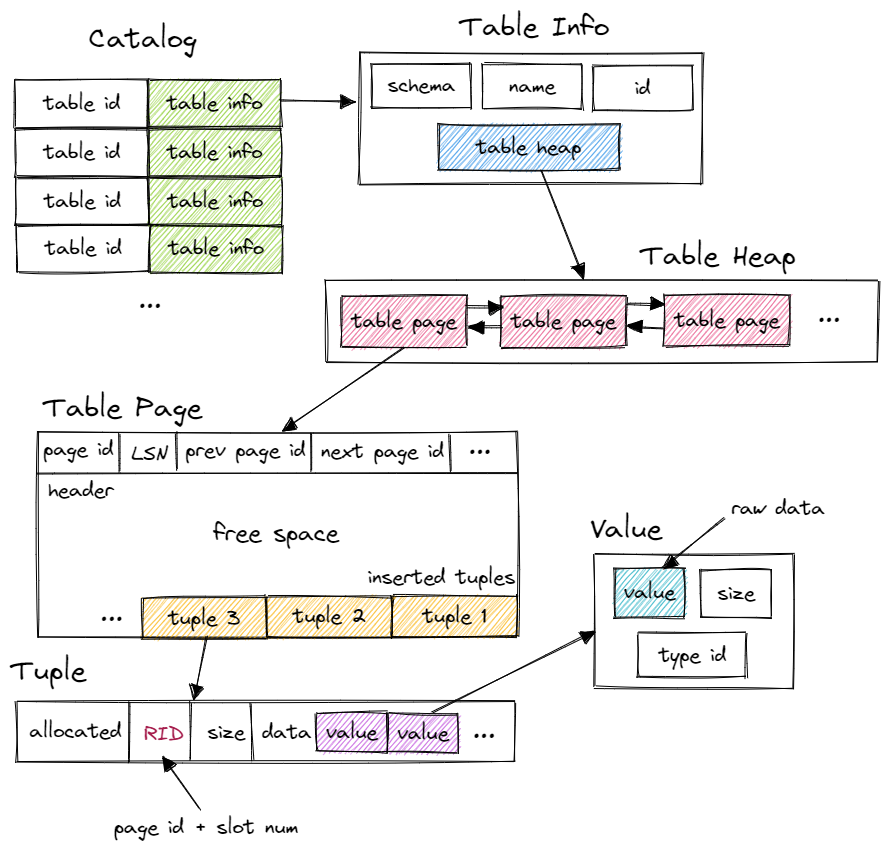
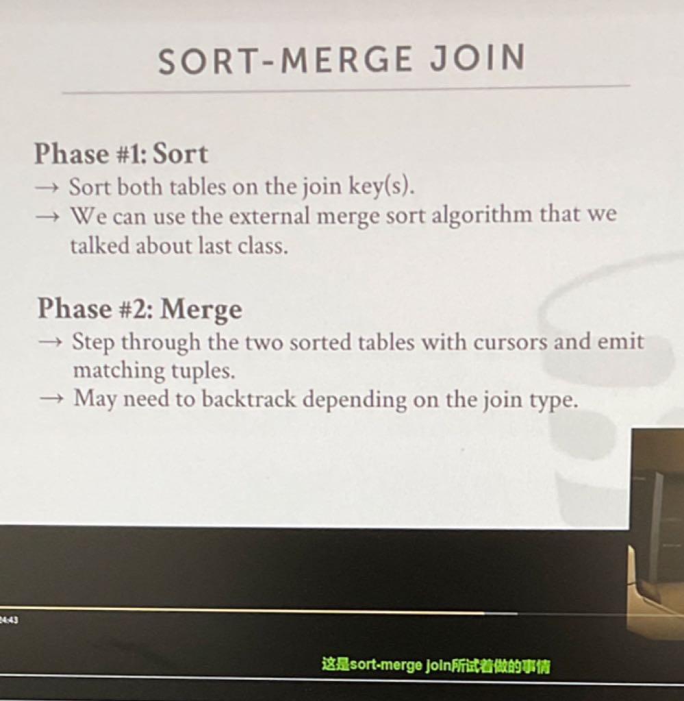
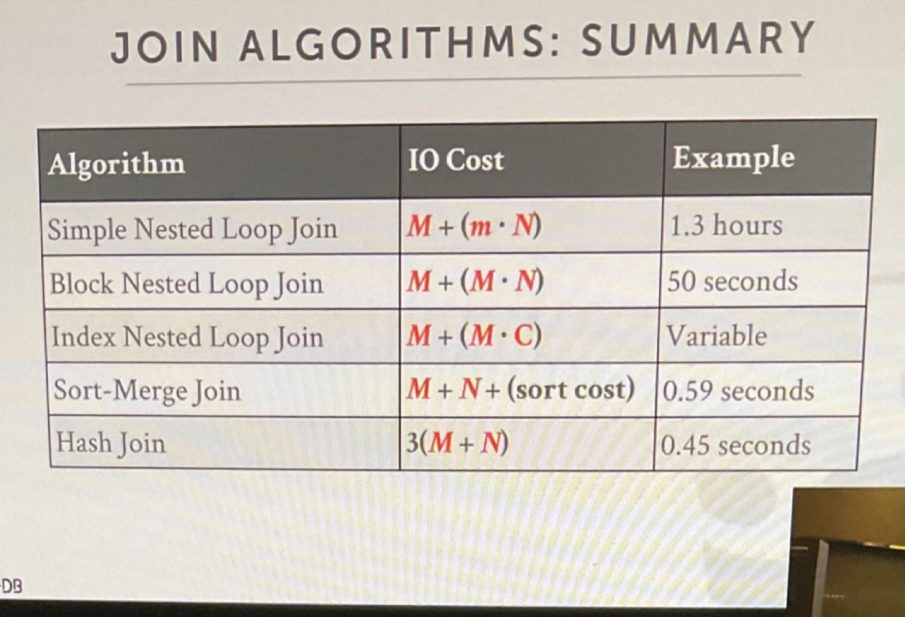
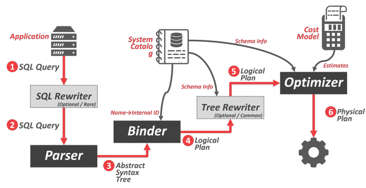

# Query Execution
这个lab我们要实现的是一堆操作算子。这里除了写一些lab3用到的算子，还有一些其他算子也写上去。
 这是445文件组织结构

## 执行模型(火山模型)
- 什么是火山模型，它是怎么工作的：火山模型(迭代模型)是面向数据流的查询执行模型，它的核心是迭代器，通过迭代器的移动遍历查询结果。在火山模型中，SQL语句会被解析并生成一棵查询树，查询树的每个节点为一个代数运算符(operator)。每个代数运算符会被看成是一个迭代器，然后每个迭代器会提供一个next()接口，通常包含三个步骤：
  1. 调用子节点 Operator 的 next() ，获取一个元组（Tuple）
  2. 对元组执行 Operator 特定的处理
  3. 返回处理后的元组给父节点

   通过火山模型，查询执行引擎可以优雅地将任意 Operator 组装在一起，而不需要考虑每个 Operator 的具体处理逻辑。查询执行时会由查询树自顶向下嵌套调用 next() ，数据流则自底向上地被拉取处理。所以，这种处理方式也称为拉取执行模型（Pull Based）。
- 火山模型的优点是处理逻辑清晰，每个 Operator 只要关心自己的处理逻辑即可，耦合性低，可以单独抽象实现。但是它的缺点也非常明显，主要是两点(现代数据库磁盘I/O和内存使用不再是重点，而是CPU的运行效率)：
  1. 火山模型的每个operator需要获取一个tuple，就需要调用孩子节点的Next函数，这就导致虚函数调用次数过多(你看看445，Next是一个虚函数，virtual auto Next(Tuple *tuple, RID *rid) -> bool = 0;)，造成大量的开销(因为每次调用虚函数都要查虚函数表和间接寻址)，降低CPU利用率。
  2. 数据以行为单位进行处理，不利于发挥现代 CPU 的特性，即行式存储容易导致CPU Cache失效。因为行式存储每个tuple可能需要大量的存储空间，从而导致tuple可能超出CPU Cache的容量，这就导致频繁的缓存命中失败，这就需要让缓存反复地逐出页面，然后重新在内存加载数据。此外，一个tuple用完就丢，如果一次只访问一个列或少数几个列，CPU Cache的命中率低得可怜，也会导致反复地从内存加载数据。
- 改进方法：
  1. 规则优化：要对火山模型进行优化，一个最简单的方法就是减少执行过程中 Operator 的函数调用。比如，通常来说 Project 和 Filter 都是常见的 Operator，在很多查询计划中都会出现。可以将这两个 Operator 融合到了其它的 Operator 中。这样做有两个好处：降低了整个查询计划中 Operator 的数量，也就简化了 Operator 间的嵌套调用关系，最终减少了虚函数调用次数。单个 Operator 的处理逻辑更集中，增强了代码局部性能力，更容易发挥 CPU 的分支预测能力。
  2. 向量化模型(Vectorized/Batch Model)->主要针对列式存储：向量化模型与火山模型的最大差异就是，其中的 Operator 是向量化运算符，是基于列来重写查询处理算法的。所以简单来说，向量化模型是由一系列支持向量化运算的 Operator 组成的执行模型。向量化模型依然采用了拉取式模型。它和火山模型的唯一区别就是 Operator 的 next() 函数每次返回的是一个向量块，而不是一个元组。向量块是访问数据的基本单元，由固定的一组向量组成，这些向量和列 / 字段有一一对应的关系。向量处理背后的主要思想是：列式存储可以更好地利用CPU Cache，每次只取一列的部分数据，返回一个可以放到 CPU Cache 的向量，那么又可以利用到 CPU Cache，减少从内存加载数据的次数。此外这样可以更好地使用SIMD，因为OLAP是计算密集型的系统，需要对大量数据进行相同的操作，而一个operator是对输入数据进行相同的操作，因此一次传递同一列的一个batch的数据可以更好地利用SIMD(还有向量寄存器)。并且采用了late materialization(推迟转换)，推迟列式向行式的转换时间。通过这些方法可以显著提升查询性能。
  3. 编译执行：这个不太懂，不过主要是减少Next函数的调用，减少虚函数调用的开销。我好像又懂了，这个模型目的是解决大量虚函数调用导致性能的损失。因此该模型将pull Based改成了Push Based，即将operator之间从pull Based模型的虚函数调用，变成了以数据为中心的顺序执行，并自底向上地执行。执行逻辑的起点直接就在最底层的operator，其处理完一个tuple后，再传给上层operator继续处理，而不是上层调用Next，从而消除了火山模型中大量的虚函数调用。此外，为了充分利用CPU，我们最好在执行查询树时让数据一直留在寄存器，那么每个operator就可以直接处理寄存器中的数据，即让大部分指令可以直接从寄存器取数，极大地提高了 CPU 的执行效率。但这种方法有两个难题，首先是如何代码生成，让数据尽量留在寄存器中。还有就是要处理Pipeline-breaker，比如对于join(拿hash join举例)，查询计划中的 Join 操作要生成 Hash 表加载到内存中，这个动作使数据必须离开寄存器，称为物化（Materilaize），而这就不可避免地增加了处理时间。(具体还得看看论文)

- 火山模型operator的并行(有点不确定，当时听课时有点蒙)：
  1. Intra-Operator(Horizontal)：  operator内部的并行处理，需要先对输入数据进行分区，然后对不同分区的数据并行执行该operator的操作。输入数据包含了数据库存储的数据和中间数据，其中数据库存储的数据分区主要依赖于物理分区，比如不同设备，不同文件。而中间结果分区则依靠分区函数来决定哪个分区由哪个进程负责。
  2. Inter-Operator(Vertical)： 父子operator的并行，负责实现并行的是Exchange Operator，被插入到查询树中的一个或多个位置，如下图。其中Exchange Operator采用的是生产者消费者模型，父Operator作为消费者，子operator作为生产者，在一个共享数据结构中进行同步和数据交换。生产者端的 exchange 算子会作为 driver 驱动查询执行，其输出会放到被共享数据结构中，同时发送一个信号量来提醒消费者。消费者端的 exchange 算子就和普通的迭代器一样，只不过它接收输入时会通过进程间的通信而不是内部的方法调用。注意，火山模型中所有其他模块都是基于 demand-driven，即 iterator 调用 Next() 方法后，数据流再从下游传到上游，控制流和数据流的方向相反。而 Exchange 算子则是基于data-driven，生产者侧的数据就绪后再通知消费者执行，数据流和控制流的方向相同。因此使用了Exchange算子后还可以进行流量控制，即生产者生产速度太快，导致数据堆积，此时消费者可以通过信号量等通信手段让生产者放慢速度  Exchange Operator有3种模式(目标是服务Intra-Operator和Inter-Operator)：
       1. Gather：子Operator中存在多个线程并发执行operator，然后使用Gather Exchange Operator对这些结果进行收集整理，然后产生一个输出流流向父节点。
       2. Repartition：子Operator中存在多个线程并发执行operator，然后父节点也存在多个线程并发执行，那么可以用一个Repartition Exchange Operator收集子Operator这些线程产生的结果，然后分发到父Operator中对应的线程中进行处理
       3. Distribute：该Exchange Operator的输入流只有一个，但是输出流却有多个，即父Operator有多个线程并发执行。比如hash join，输入分别是左表和右表，但父节点采用了分桶的情况，那么可以通过Exchange Operator将左表和右表的数据发到对应桶中进行join。
   

## SeqScan(lab3)
该算子实现的是对全表进行扫描，先从Table Heap中拿到第一个page的第一个tuple，然后不断往后迭代，直到最后一个page的最后一条tuple。由于采用的是火山模型，因此每调用一次该算子的Next函数，就会往上层查询算子传一条tuple。之后再lab4中对其进行了优化，将filter下推到这一层，以减少shared锁的获取。
 优化方法：
  1. Prefetching
  2. Buffer Pool Bypass：内存旁路，开辟一个内存空间，在那里读数据，而不是放进Buffer Pool，避免污染它
  3. Parallelization：并行读取
  4. Zone Maps：分区图，对page中的数据提前计算并保存一些元数据(这些元数据可以保存到另外的page中)，比如某些属性的最大值，最小值等。operator可以根据这些元数据来判断是否要遍历该page。唯一缺点就是需要进行维护这些元数据。
  5. late Materialization：查询时推迟将列式转换为行式，避免将带着一大堆属性的tuple传到上层，对列式存储的查询特别有用。
  6. Heap Clustering：聚簇索引
## Insert(lab3)
该算子实现的是在指定表插入一条或多条tuple。<u>注意Insert在445中是，当上层查询调用Insert算子的Next函数，该算子会将所有需要Insert的tuple都插入完成后，向上层返回插入tuple的数量。</u>该算子在抽象语法树上有一个孩子节点，用来获取需要插入的tuple，因此该算子需要不断调用孩子节点的Next函数，每次获取一条待插入的tuple，并将其插入到表中。最后，如果这个表上建立了索引，那么还需要将新插入的tuple插入到索引中。445对于tuple的插入是直接插入的，并更新table_write_set，如果事务Abort，那么就根据这个table_write_set来回滚。

## Delete(lab3)
该算子实现的是在指定表中删除一条河多条tuple。实现和Insert是一模一样的。而445中的删除是采用墓碑的删除方法，即对于要删除的tuple，只是简单标记这个tuple要删除，只有当事务提交之后，才会真正地删除该tuple。那么Abort就直接将这个标记去掉就行了。

## IndexScan(lab3)
该算子实现的是通过索引对表进行遍历，实际上是对B+树索引的叶子节点进行遍历，直接拿B+树实现的迭代器进行遍历就行了，和SeqScan一样。但要注意的是该索引不是聚簇索引，因此还需要通过record Id找到对应的tuple，然后再传给上层。lab4还进行了优化，实现了单点查询。根据对SQL的编译，我们可以获得filter的条件(filter的形状是x=a)，并且445只支持索引key唯一的情况。那么先获取filter需要查找的属性值a，然后从索引中查找key=a的tuple的record Id，如果找到，那么就从page中读取这个tuple，否则该属性值为a的tuple不存在于这个表中。
- 索引Scan的优化(目的是减少磁盘I/O)：
  1. 最简单的方法就是找到所有要读取的tuple的record Id，然后统计一下这些tuple所在的page，再去读取page。而不是每读一个tuple都需要读一次page进内存。
  2. 如果查询属性超过两个，且这些属性上刚好建立了索引，那么就可以将IndexScan优化为Multi-Index Scan。可以开多个线程，每个线程扫描一个索引，并构建出一个位图(比如位图每个位表示tuple，1表示需要读取该tuple)。那么生成所有位图后就可以根据查询的实际情况来合并这些位图，然后再使用1的内容读取page。

## Aggregation(lab3)
该算子实现的是聚合函数，包括了Sum、Min、Max、Count(Column)、Count(*)，但一个聚合算子一次只处理一个聚合函数。
1. Sum：统计某个属性的和
2. Min：找到某个属性的最小值
3. Max：找到某个属性的最大值
4. Count(column)：统计有多少个tuple在某个属性值上是非NULL的
5. Count(*)：统计该表有多少个tuple，反正就是Count(column)加上属性值是NULL的tuple数量。

 首先，聚合算子需要求出所有Group By分组的聚合结果后，才会向上传递结果。但注意，上层每调用一个Next，只会向上传递1个Group By分组的聚合结果，比如要聚合的表Group By后有多个分组，一次Next只会传递一个分组的结果。
  在445中，聚合算子的实现是通过hash表实现的，这是为了处理Group By，其中hash表的key为需要Group By的属性(即分组)，value为对应分组的聚合结果。聚合算子有一个孩子节点，用来读取需要聚合的所有tuple。将所有tuple读取后，将所有tuple散列到hash表中，并且当一个tuple散列到其对应的分组所在的Bucket中时，需要根据要计算的聚合函数计算一次，比如Sum，就将该tuple的需要聚合的属性的值加到该Bucket的value中。当处理完所有tuple后，聚合函数的值也计算完毕了。而对于非Group By，那么key为空，因此所有tuple都会被散列到同一个位置，直接算就行了。唯一要注意的是对空表的聚合，返回一个初始值上去就行了。

## NestedLoopJoin(lab3)
这里实现的是等值连接和左连接，注意左连接如果左表的tuple没有与任何一条右表tuple完成Join，那么仍然需要让左表tuple和右表tuple进行Join，只不过右表tuple里面所有值都是interger_null而已。 我们实现的Nested Loop Join是Simple/Stupid Join，即对左表的一条tuple和右表所有tuple进行join，完成后才到下一条左表tuple，而且这里两个表都放进内存了。这里有两个孩子节点，用来读取左表和右表的所有tuple，但注意Init就要读取两个表的所有tuple，否则没办法做join。然后上层每调用一次Next函数，该算子就返回一个join结果上去，一直调用Next直到整个Join做完。

## NestedIndexJoin(lab3)
同理这里实现的是等值连接和左连接，但右表在连接属性上构建了一个索引。该算子有一个孩子节点，用来获取左表的所有tuple。然后取一个左表的tuple，使用该tuple的连接属性值，通过右表的索引查询所有与之匹配的右表tuple，然后进行join。
## Sort/Order By(lab3)
实现排序，分为ASC(升序，默认)和DESC(降序)，这里假设所有tuple可以放进内存，因此就是个内部排序，所以俺是调包侠。该算子有一个孩子节点，就是获取所有需要排序的tuple。

## Limit(lab3)
实现Limit算子，根据SQL要求的限制个数，最多向上传递它要求的限制个数个tuple。

## TopN(lab3)
我们实现了该算子，并且尝试了静态优化，即将sort+limit优化为TopN。对于TopN，由于只是取排序结果的一部分，因此没必要对表进行排序，而是直接构建一个堆，从堆中选择N个tuple就可以了。在445中直接化身调包侠，使用std::priority_queue来做。
  而静态优化稍微有点麻烦，445的规则优化通过递归来完成，通过对 plan tree 进行后序遍历，自底向上地适用规则，改写节点。遍历到某个节点时，通过 if 语句来判断当前节点的类型是否符合我们要优化的类型，若符合则进行优化。在这里，优化为一个 TopN 算子的形式是，上层节点为 Limit，下层节点为 Sort，不能反过来。同样，我们对 plan tree 进行后续遍历，在遇到 Limit 时，判断其下层节点是否为 Sort，若为 Sort，则将这两个节点替换为一个 TopN。

## Group By和Distinct
- Sort + Nested Loop
>           先对需要Group By或者Distinct的表进行排序，如果表太大放不进内存，那么需要使用外部排序。然后对有序的表进行Group By或者是Distinct。
- Hash(lab3)
>           先根据需要进行Group By或者Distinct的属性，对表散列到一个Hash表中。由于hash表自带分类的功能，相同key会映射到同一个位置，因此可以直接从hash表中获得Group By或者Distinct的结果。但要注意的是，这种方法要求数据分布较为均匀，并且产生的hash表可以放进内存中。但假如遇到了超过可用内存的情况，那么思路就像可扩展hash一样，先对数据进行分桶，然后对桶内的数据进行hash，加入桶内数据还是太多，那么可以继续进行分桶，直到可以将hash表放进内存中。
## Join
对于Join，一般将小表作为左表。
- Nested Loop Join(适用范围：一定能用，但在连接属性具有索引时效率更高，因为能减少page的读入，如果没有索引，就使用Sort-Merge Join或者hash Join。此外，Nested Loop Join更适合小表的Join，比如能放进内存的表，而另外两种方法则适合大表的Join，对于Sort-Merge Join处理大表，即使其需要排序和合并，但性能仍然比Nested Loop Join好)
  1. Simple/Stupid 对于左表，选择一个tuple，然后与右表的所有tuple进行Join操作。做完之后再选择左表的下一个tuple，重复该过程。这样虽然最简单，但I/O就会很多，总的I/O次数为M+(m*N)，其中M为左表的page数量，m为左表的tuple数量，N为右表的page数。
  2. Block 对上面I/O次数的m进行优化，当读进来一个左表的page时，对该page中的所有tuple同时与右表的所有tuple进行Join操作。做完之后读取左表的下一个page，然后再进行Join。因此I/O次数会优化为M+(M*N)。
  3. Index 如果Join的key在右表中建立了索引，那么就可以先使用索引找到与左表tuple对应的所有右表tuple所在的page，然后将这些page读到Buffer Pool中进行Join，而不是像第1种方法那样将右表所有page都读进来。因此I/O次数变成了M+(m*C)，C是索引page和读进来的右表page。
- Sort-Merge Join
 具体做法如图所示，第一步先对左表和右表进行排序，第二步则是对排好序的左右表进行Join操作，具体的Join算法就是当左右表某个位置的key不相等，那么就根据情况不断地交错移动左右表的光标。如果key相等那么在光标位置就可以进行Join。 
 **<u>Sort-Merge Join的适用范围：当要Join的key是聚簇索引(即提前有序)，那么可以使用Sort-Merge Join，因为使用了聚簇索引的表的page中tuple的物理位置和我们在索引中定义的顺序相匹配，即直接有序。或者是上层的查询需要进行排序(比如Order By等)，那么可以在Join这一层进行Sort-Merge Join，因为Join产生的表可能会很大，如果上层进行排序的话代价比较高(成本模型？)。</u>** 
 **<u>Sort-Merge Join的优缺点： 优点：Sort-Merge Join的优点在于它不依赖数据分布，无论数据分布或连接的条件如何，Sort-Merge Join都会对输入表进行排序，然后在进行连接，以确保准确的连接结果，因此对于各种连接操作都是可靠的。此外，它可以在一定程度上减少随机读的情况，因为两个表有序，对于一次扫描就可以判断是否进行连接，并且不需要重复读取右表，不会像Nest Loop Join那样频繁且重复地读取右表。</u>** 
 **<u>缺点：Sort-Merge Join的缺点在于排序和合并(Sort-Merge)，一旦数据量太大，那么排序和合并需要较高的磁盘I/O和内存需求，导致其成为Sort-Merge Join性能的瓶颈。这就需要考虑一下Sort-Merge Join的适用范围和使用成本了。此外，Sort-Merge Join不太适合小表，因为排序和合并的开销会更显著</u>**

- Hash Join
1. 当建立的hash表可以放进内存中，hash Join分为两个阶段：建立阶段(build phase)和探测阶段(probe phase)。
   - Build Phase：选择左表(**<u>建立hash表的那个表一般选择较小的那个表，以减少建立hash表的时间和空间</u>**)，对左表每个tuple上的连接属性使用hash函数构建一个hash表。
   - Probe Phase：对右表，扫描它的每一个tuple，并根据构建左表的那个hash函数计算连接属性的hash值，假设计算得到的hash值落到某个bucket，并且右表的tuple和bucket中的元素满足连接条件，那么就进行Join操作。
2. 当建立的hash表放不进内存中(Grace hash join)，思路和前面的Group By以及Distinct一样。
   - 第一阶段：先把左表的每一个tuple分别用同一个hash函数在连接属性上进行分块。分块后每个tuple将会被分到对应的bucket中，然后将其落盘。注意每个bucket中的数据都可以放到内存里面，但仍然可能出现一个或多个bucket仍然无法放到内存中，此时可以使用递归的方式对每个bucket采用该算法，直到每个bucket都可以放到内存。
   - 第二阶段：采用上面第1点的做法就可以了，唯一要注意的是，对左表bucket构建hash表的hash函数不能与前面分桶使用的hash函数相同。

     **<u>hash Join的适用范围：当需要连接的表太大，无法放进内存时，或者连接条件会导致产生大量连接结果时，应该使用hash Join。尤其是在没有索引，数据分布均匀，并且上层不需要进行排序的条件下性能更好。</u>** 
     **<u>Hash Join的优缺点： 优点：hash join相比于Nested Loop Join和Sort-Merge Join而言，能显著地减少磁盘I/O次数。并且通过hash函数对左表和右表进行散列，能够让右表每一个tuple一次性找到所有符合连接条件的左表元素，从而增加Join的效率。</u>** 
     **<u>缺点：hash join极其依赖数据分布，当数据分布不均匀时，比如需要散列的连接属性的值大部分都相同，那么需要处理更多的hash冲突。此外，如果该表放不进内存导致要分桶，那么大量相同的连接属性会分到同一个桶，这时可能会导致无限递归分桶。此外，hash join不适合连接小表，构建hash表可能会影响join的性能。同时，hash join也难以处理连接条件具有高度选择性的情况，因为高度选择性的条件涉及的tuple数量少，构建hash表时可能会花费大量的代价去处理那些没用的tuple。</u>**

    布隆过滤器的原理、作用和应用：
      作用：布隆过滤器可以判断某个key是否一定不存在，但对于是否存在，只能够给出可能存在。
      原理：使用k个不同的hash函数和一个较长的位数组(初始值都是0)，当来了一个key，分别通过k个hash函数将这个key映射到位数组中，并将对应位置的0改为1。若映射后位置已经为1，则直接跳过，计算下一个hash函数。如果要判断某个key是否不存在，那么就通过这k个hash函数将这个key映射到数组中对应位置，并依次检查相应位置的元素是否都被设置为1，如果有任何一个元素不是1，那么就可以肯定该key不存在。但由于不同key的映射结果可能相同，因此无法判断key是否一定存在。
      应用场景：
    1. 对于hash join的优化：可以使用布隆过滤器进行优化Probe Phase过程。在Build Phase构建左表的hash表时，可以同时构建一个布隆过滤器。然后再Probe Phase阶段，先通过布隆过滤器判断右表的连接属性是否存在于左表构建的hash表中，如果不存在，那么就可以直接处理右表下一条tuple。因为进入映射到左表的hash表后可能还要处理冲突，那么就会更慢。
    2. 对表的属性值进行查询或过滤时的优化：对每个表的属性可以构建一个布隆过滤器，当要查询某个表的某个属性值对应所有tuple时，可以先通过布隆过滤器判断一下要查询的属性值是否存在于这个表中，如果不存在，那么就没必要对这个表进行访问，避免额外的磁盘I/O。
    3. 分布式数据库传输数据：当一个节点需要另一个节点的数据时，在某些情况下可以将布隆过滤器发过去给另一个节点，让其在传输数据前先过滤掉部分数据，减少数据量的传输。

### Lab3完成的是等值连接和外连接
>               内连接：连接结果仅包含符合连接条件的行，并且参与连接的两个表都应该符合连接条件。最常见的内连接为等值连接。
>               外连接：连接结果不仅包含符合连接条件的行，同时也包含自身不符合条件的行。包括左外连接、右外连接和全外连接。左外连接就是在等值连接的基础上加上左表中未能成功匹配的数据，以左表为准，去匹配右表。其他的外连接也是这样。

# 查询优化和查询计划
## 查询优化器

如图所示为查询优化器，在445中是将SQL通过SaveParseTree(Parser)转换为语法树后，通过Binder将语法树中的命名对象记录下来，比如表名、列名以及需要进行的操作，然后将Binder Tree的每个节点转换为具体的查询计划(445每个operator都给你一个plan)，之后通过一些静态规则对这个抽象语法树进行优化，然后才执行：
 
 1. SQL Rewriter：对SQL进行重写或重排，比如为SQL语句加一些额外的信息进行标记，如提供某个表的磁盘位置。
 2. 解析器：进行词法分析和语法分析，将SQL字符串转换为抽象语法树
 3. Binder：将SQL查询中的命名对象(如表名，属性名)转换为某种内部标识符(445是直接记录下来)，内部标识符是为了快速找到这个命名对象所在的位置
 4. Tree Rewriter(445只实现了这个)：通过条件触发和静态规则改写抽象语法树，从而完成优化。注意，静态规则的原理是等价关系代数，如果两个关系代数产生的一组tuple相等，那么它是等价的。基于此原理，我们可以移动某些operator，或者用其他operator来替换原有的operator，从而将成本高的关系代数转换为成本低的关系代数，比如sort+limit->TopN，或者谓词下推，还有就是移除那些傻逼判断条件(where 1 = 0)。
 5. 查询优化器(optimizer)：会根据SQL语句构建出若干个查询方案，并通过使用成本模型来找出最佳的方案。
 6. 生成物理计划：具体的operator

成本模型不太懂